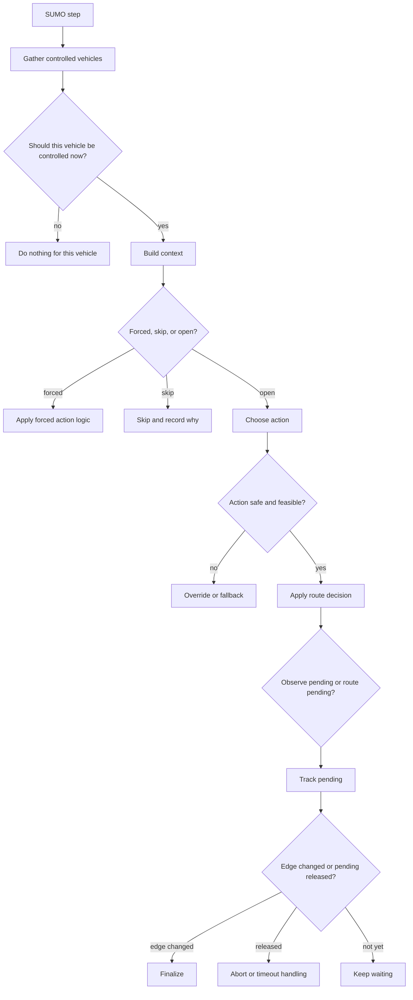

# RL Pipeline Workflow and Guard Rails

This document is a practical guide to the RL routing pipeline.

It explains:

- what the pipeline is trying to do,
- how a vehicle moves through the control flow,
- how training and inference share logic,
- what each pending state means,
- and which guard rails prevent the system from making unsafe or stale decisions.

The goal is to make the pipeline easy to follow for someone reading the code for the first time, while still keeping enough detail to support debugging and future changes.

## What the Pipeline Is Optimizing

The current RL objective is **average travel-time minimization**.

That means the system mainly tries to:

- get vehicles to their destinations,
- keep travel time low,
- avoid congestion-amplifying choices,
- and avoid pathological behaviors like loops, dead ends, route mismatch, or stale pending decisions.

Vehicle deadlines may still appear in data structures for backward compatibility, but they are not the main target of the current training objective.

## Where the Logic Lives

The main files are:

- [core/STR_SUMO.py](/home/anhvu01212001/anhvu/STR_Project/STR-Summer-Project-Base/core/STR_SUMO.py)
  This is the runner that decides which vehicles get passed to the controller on each SUMO step.
- [core/junction_decision_engine.py](/home/anhvu01212001/anhvu/STR_Project/STR-Summer-Project-Base/core/junction_decision_engine.py)
  This is the low-level decision engine. It knows road geometry, lane feasibility, commit timing, route application, and progress checks.
- [core/shared_decision_policy.py](/home/anhvu01212001/anhvu/STR_Project/STR-Summer-Project-Base/core/shared_decision_policy.py)
  This is the shared orchestration layer used by both training and inference. It classifies decisions, builds pending records, and evaluates when pendings should be released.
- [core/rl_training_pipeline.py](/home/anhvu01212001/anhvu/STR_Project/STR-Summer-Project-Base/core/rl_training_pipeline.py)
  This is the training controller. It selects actions, stages transitions, applies replay rules, and writes episode metrics.
- [controller/QLearningController.py](/home/anhvu01212001/anhvu/STR_Project/STR-Summer-Project-Base/controller/QLearningController.py)
  This is the inference controller. It runs a trained policy in the live simulation without replay updates.

A good mental model is:

- `STR_SUMO` decides **when** a vehicle is eligible for control.
- `junction_decision_engine` decides **what is physically and topologically possible**.
- `shared_decision_policy` decides **how to interpret and manage the decision lifecycle**.
- the training or inference controller decides **what action to take next**.

## Glossary

These terms appear throughout the code and are worth understanding early.

### Decision point

A place where the vehicle has more than one meaningful outgoing direction and the controller may need to choose.

### Context

A single-step snapshot of the vehicle at its current edge, lane, speed, distance-to-end, and destination. The context also includes which actions are valid now, which are valid after a lane change, and whether the vehicle is already in the commit window.

### Commit window

The short zone near the end of the current edge where it is too late to rely on a proactive lane change. In the commit window, only `lane_feasible_now_actions` are considered valid.

### Lane-now action

An action that can already be taken from the current lane without needing more lane alignment.

### Proactive action

An action that is reachable only if the vehicle aligns lanes earlier on the same edge.

### Pending decision

A decision that has been opened but not fully resolved yet. The route may already be committed, or the system may still be waiting to see whether a lane change actually takes effect.

### Observe pending

A pending state used while the system is waiting to see whether a requested lane change is taking effect.

### Route pending

A pending state used after a route choice has been committed and the system is waiting for the vehicle to leave the decision edge or prove that the commitment failed.

### Active pending

A pending that still needs aggressive same-edge monitoring. Observe-phase pendings and proactive route pendings are active.

### Passive pending

A pending that should not be force-controlled on every same-edge step. A `lane_now` route commitment usually becomes passive, because once the route is correctly committed, waiting in queue is not itself a routing failure.

### Release

A controlled cancellation of a pending decision because the pending is no longer valid or useful.

### Fallback

A safer replacement action used when the chosen action is blocked, unsafe, or invalid.

## End-to-End Flow

At a high level, each control cycle looks like this:

The rest of this document explains each part in plain language.

## Phase 1: Selecting Vehicles for Control

The outer loop is driven by [core/STR_SUMO.py](/home/anhvu01212001/anhvu/STR_Project/STR-Summer-Project-Base/core/STR_SUMO.py).

On each SUMO step:

1. The runner scans controlled vehicles currently in the simulation.
2. It checks whether the vehicle changed edges.
3. It asks the active controller `should_control_vehicle(...)` whether the vehicle should still be reconsidered even without an edge change.
4. If either condition is true, the vehicle is added to the batch passed into `make_decisions(...)`.

This is an important design choice.

The controller is **not** asked to re-decide for every vehicle on every step. That would be expensive and would also create a lot of fake “decision opportunities.” Instead, vehicles are reconsidered only when something meaningful is happening:

- the vehicle moved to a new edge,
- the vehicle is in an active pending state,
- or the controller explicitly says it should be revisited.

## Phase 2: Building the Decision Context

The context is built in `build_context(...)` inside [core/junction_decision_engine.py](/home/anhvu01212001/anhvu/STR_Project/STR-Summer-Project-Base/core/junction_decision_engine.py:140).

The context answers the most important question in the whole pipeline:

> What choices are actually possible for this vehicle right now?

It computes:

- `edge_valid_actions`
  All outgoing directions that exist from the current edge.
- `lane_feasible_now_actions`
  Directions that can be taken immediately from the current lane.
- `reachable_with_lane_change_actions`
  Directions that are still reachable if the vehicle changes lanes early enough.
- `available_actions`
  The final filtered set of actions the controller is allowed to consider.
- `required_lane_shift`
  How many lane shifts each action would need.
- `commit_window`
  Whether the vehicle is already close enough to the junction that proactive lane changes are no longer trusted.
- `forced_action` and `skip_reason`
  Signals that the controller should not treat this as a normal open choice.

### Why this phase matters

This phase is the first and strongest guard rail.

Without it, the policy could try to choose:

- directions that do not exist,
- directions that require impossible lane changes,
- or proactive maneuvers that are already too late.

That would pollute both training and inference with unrealistic choices.

## Phase 3: Decision Classification

The shared policy classifies the context using `classify_decision(...)` in [core/shared_decision_policy.py](/home/anhvu01212001/anhvu/STR_Project/STR-Summer-Project-Base/core/shared_decision_policy.py:75).

A context becomes one of three things:

- `forced`
  There is only one meaningful action left.
- `skip`
  The system should not open a proper decision here.
- `open`
  The controller is allowed to choose among multiple actions.

### Why this phase matters

This keeps the RL policy honest.

The policy should only be credited or blamed when there was a real choice. If the geometry already forced the outcome, then pretending the model “decided” would distort metrics and replay data.

## Phase 4: Choosing an Action

If the decision is open, the controller chooses an action.

In training, this happens inside [core/rl_training_pipeline.py](/home/anhvu01212001/anhvu/STR_Project/STR-Summer-Project-Base/core/rl_training_pipeline.py:83).
In inference, it happens inside [controller/QLearningController.py](/home/anhvu01212001/anhvu/STR_Project/STR-Summer-Project-Base/controller/QLearningController.py:373).

Before the action is allowed to proceed, several filters may apply.

### Policy candidate filtering

`policy_action_candidates(...)` narrows the action set before the actual choice is made.

This keeps the policy focused on actions that are not only feasible, but also reasonable enough to consider.

### Loop and dead-end safety prefilter

The chosen action is then checked by `prefilter_action_for_loops(...)`.

This is a safety filter that catches choices likely to:

- re-enter a dead end,
- create obvious short-cycle behavior,
- or worsen route quality in a way the system already knows is unsafe.

### Fallback selection

If the original action cannot be used, the shared policy chooses a fallback with `select_fallback_action(...)`.

Fallbacks can be broad or strict depending on the situation.

Examples:

- in some safety override cases, the fallback can consider a broader ranked set,
- after observe aborts or cooldown blocks, the fallback is often restricted to `lane_now_only=True` so the controller does not immediately reopen another proactive chase on the same edge.

This guard rail is especially important after failures. It prevents the system from endlessly retrying a maneuver that already proved fragile.

## Phase 5: Applying the Route Choice

Once an action survives the filters, the route is applied.

This is done through shared helpers in the junction engine so training and inference use the same route-commit semantics.

If route application fails, the controller records the failure and does not pretend a clean decision succeeded.

This is another major guard rail.

It keeps training and runtime aligned with actual SUMO route continuity, instead of letting the model “believe” it chose something that the route layer could not really honor.

## Phase 6: Pending States

Once a decision is opened, it may not be fully resolved immediately. That is why the pipeline has pending states.

There are two main pending constructors in [core/shared_decision_policy.py](/home/anhvu01212001/anhvu/STR_Project/STR-Summer-Project-Base/core/shared_decision_policy.py):

- `build_observe_pending(...)` at [core/shared_decision_policy.py](/home/anhvu01212001/anhvu/STR_Project/STR-Summer-Project-Base/core/shared_decision_policy.py:375)
- `build_route_pending(...)` at [core/shared_decision_policy.py](/home/anhvu01212001/anhvu/STR_Project/STR-Summer-Project-Base/core/shared_decision_policy.py:424)

### Observe pending

Observe pending is used when the controller wants a proactive action but first needs to see whether the requested lane change is actually taking effect.

During observe pending, the system watches for things like:

- whether the lane index is moving the right way,
- whether enough time has elapsed,
- whether the vehicle is already too close to commit,
- whether the vehicle has effectively stalled.

If the observation succeeds, the pending can be promoted into a committed route pending.
If it fails, the decision is released and a safer fallback may be applied.

### Route pending

Route pending is used once the route has already been committed.

At that point the pipeline is no longer asking, “Which route should we choose?”
It is asking, “Did the chosen route actually materialize the way we expected?”

Route pending stores metadata such as:

- the intended action,
- the decision edge,
- the decision step,
- the intended next edge,
- progress metadata,
- and the resolution mode (`lane_now` vs `proactive`).

## Phase 7: Active vs Passive Pending

This is the most important subtlety in the current design.

The helper `pending_requires_active_same_edge_monitoring(...)` in [core/shared_decision_policy.py](/home/anhvu01212001/anhvu/STR_Project/STR-Summer-Project-Base/core/shared_decision_policy.py:489) decides whether a pending should be treated as **active** or **passive** on the same edge.

### Active pending

Active pending means the system still needs to watch the same edge closely.

These are active:

- `observe_lane_change` pendings,
- proactive `route_pending` decisions.

Why?

Because these decisions can still fail while the vehicle is on the same edge. The system must keep watching for:

- no progress,
- missed commit timing,
- lane-feasibility collapse,
- or long-lived same-edge stalling.

### Passive pending

Passive pending means the route is already correctly committed and the vehicle does **not** need to be force-controlled on every same-edge step.

The main example is a `lane_now` route commitment.

Why?

Because once the route is correctly committed from the current lane, a vehicle sitting in queue, at a red light, or in local congestion is not making a new routing mistake. It is just waiting.

This distinction prevents a major pathology:

- a correct `lane_now` decision should not be repeatedly revisited and punished as if it were a failed proactive chase.

## How Progress Is Measured

Same-edge pending progress is updated by `pending_progress_update(...)` in [core/junction_decision_engine.py](/home/anhvu01212001/anhvu/STR_Project/STR-Summer-Project-Base/core/junction_decision_engine.py:267).

The progress logic is intentionally different for proactive and passive cases.

### For proactive route pending

The logic is strict.

Small creeping movement is not enough.
The pending only refreshes meaningfully when there is strong evidence that the route execution is improving, such as:

- a substantial drop in distance-to-end,
- or the action becoming lane-feasible-now.

This is designed to stop bad proactive pendings from staying alive forever on tiny movement.

### For lane-now route pending

The logic can be looser, because the main question is not “Are we still chasing a lane change?” but “Has the already-committed route become contradictory?”

The important design principle is:

- proactive pendings should expire if they are not genuinely progressing,
- passive lane-now pendings should not be punished just for queueing on the same edge.

## How Pending Release Works

Pending release is evaluated by `evaluate_route_pending_release(...)` in [core/shared_decision_policy.py](/home/anhvu01212001/anhvu/STR_Project/STR-Summer-Project-Base/core/shared_decision_policy.py:529).

The release logic looks at:

- current feasibility,
- whether the vehicle is still on the decision edge,
- how long it has been since the last real progress,
- total pending age,
- and whether the vehicle is in the commit window.

Possible release reasons include:

- `wrong_lane_commit`
- `route_no_progress_abort`
- `route_stall_timeout`
- `route_hard_timeout`

### Important rule

The timeout and no-progress releases are now applied only to pendings that still require active same-edge monitoring.

That means:

- active proactive pendings can still time out,
- passive `lane_now` pendings do not get treated as same-edge stall failures just because the car is waiting.

This is one of the most important guard changes in the current pipeline.

## Training Pipeline Walkthrough

Training lives in [core/rl_training_pipeline.py](/home/anhvu01212001/anhvu/STR_Project/STR-Summer-Project-Base/core/rl_training_pipeline.py).

### What training does that inference does not

Training has two extra responsibilities:

- it has to choose actions,
- and it has to decide what experiences are worth learning from.

So the training loop is not just “act.” It is also “label what happened.”

### Training flow in plain language

1. Iterate through controlled vehicles.
2. Resolve any existing pending first.
3. If the pending finalized because the vehicle changed edges, stage a finalized transition.
4. If the pending released because of timeout or contradiction, stage a failure transition.
5. If there is no pending, build context and classify the decision.
6. If the decision is open, choose an action using the policy.
7. Validate the action, apply overrides or fallbacks if needed, and commit the route.
8. Create a pending record if the action still needs observation or route follow-through.
9. At the end of the episode, flush staged transitions into replay using replay filters.

### Replay guard rails

Replay does **not** keep everything equally.

The trainer filters staged transitions so the model learns mainly from:

- real finalized decisions,
- meaningful timeout or observe-abort failures,
- and other genuinely informative outcomes.

It specifically avoids overweighting stale interim pending life.

That matters because otherwise the replay buffer can accidentally teach the model that “waiting with a pending open” is a valuable or normal pattern.

### Active-only pending age telemetry

Training also now samples `mean_pending_age` from active pending states rather than every same-edge wait.

This makes the metric more truthful.

If passive `lane_now` queueing dominated the age metric, the graph would look like the policy was failing even when the route choice itself had already been committed correctly.

## Inference Pipeline Walkthrough

Inference lives in [controller/QLearningController.py](/home/anhvu01212001/anhvu/STR_Project/STR-Summer-Project-Base/controller/QLearningController.py).

### What inference is trying to do

Inference is trying to reuse the same decision semantics as training, but without replay or gradient updates.

That means the runtime controller should:

- open decisions only in meaningful places,
- reuse the same pending lifecycle,
- apply the same safety guards,
- and avoid creating runtime-only churn that training never saw.

### `should_control_vehicle(...)`

`should_control_vehicle(...)` is one of the most important runtime hooks.

It decides whether a vehicle should be passed back into `make_decisions(...)` even if the vehicle has not changed edges.

Current behavior:

- active pendings still trigger same-step revisits,
- passive `lane_now` pendings do not automatically trigger same-edge revisits,
- edge change still reactivates the vehicle,
- true contradictions can still wake the controller back up.

This is the runtime version of the same guard philosophy used in training.

### `_finalize_commitment(...)`

This method is where inference checks whether an existing pending has:

- finalized cleanly,
- become contradictory,
- timed out,
- or simply needs to wait longer.

A key improvement is that passive `lane_now` pendings no longer inflate `decision_committed_skips` on every same-edge wait step.

That makes runtime telemetry much closer to real routing problems instead of queueing artifacts.

## Worked Examples

The easiest way to understand the pipeline is to look at two common cases.

### Example 1: Lane-now decision at a red light

Imagine the vehicle is already in the correct lane for turning right.
The controller commits that route.
But the light is red, so the vehicle sits on the same edge for several steps.

What should happen?

- The route commitment should stay valid.
- The system should not reopen the same routing choice every step.
- The vehicle should not be timed out just because it is waiting.
- When the vehicle finally enters the next edge, the decision should finalize normally.

This is exactly why passive `lane_now` route pendings exist.

### Example 2: Proactive lane change that never materializes

Imagine the vehicle wants a left turn that is reachable only after an early lane change.
The controller requests a lane change and opens an observe pending.
But the vehicle does not move into the needed lane and reaches the commit zone.

What should happen?

- The observe pending should be released.
- The controller should not keep chasing the same failing maneuver forever.
- Cooldown should prevent immediate same-edge proactive reopening.
- A safer fallback should be considered, often with lane-now-only restrictions.

This is exactly what the observe, release, and cooldown logic is trying to enforce.

## Main Guard Rails and What They Protect

The best way to read the system is to understand each guard by the failure it is trying to stop.

### Guard 1: Context feasibility guard

Implemented mainly in `build_context(...)`.

Protects against:

- impossible directions,
- impossible lane changes,
- and too-late proactive maneuvers.

### Guard 2: Forced/skip guard

Implemented mainly in `classify_decision(...)`.

Protects against:

- counting fake decisions,
- blaming the model when the road already forced the outcome.

### Guard 3: Loop/trap guard

Implemented mainly in the action prefilter and ranked fallback logic.

Protects against:

- short cycles,
- dead-end reentry,
- and locally tempting but globally poor actions.

### Guard 4: Pending lifecycle guard

Implemented mainly in the observe pending, route pending, progress, and release logic.

Protects against:

- stale same-edge commitments,
- repeated proactive retries,
- timeouts caused by queueing rather than routing failure.

### Guard 5: Cooldown guard

Applied after certain pending failures.

Protects against:

- immediately retrying the same bad proactive decision on the same edge.

### Guard 6: Replay guard

Implemented in the training replay filter.

Protects against:

- over-learning from intermediate waiting states,
- and teaching the policy that “long pending life” is a good outcome.

### Guard 7: Route-application guard

Applied when route commitment is sent through the route helper.

Protects against:

- training on decisions that SUMO routing never truly accepted.

## Metrics That Usually Tell the Truth

When debugging this pipeline, these metrics are especially useful:

- `pending_decision_timeouts`
- `pending_release_route_stall_timeout`
- `pending_release_route_no_progress_abort`
- `decision_committed_skips`
- `skipped_pending_hold`
- `fallback_to_lane_feasible_now`
- `same_edge_reopen_after_abort_count`
- `mean_pending_age`
- `decision_pending_at_episode_end`
- `fallback_after_timeout_count`

### How to read them together

- If `pending_decision_timeouts` is high and `pending_release_route_stall_timeout` is also high, same-edge pending management is likely still too permissive or too aggressive in the wrong place.
- If `decision_committed_skips` is very high, inference is probably revisiting too many same-edge pendings.
- If `skipped_pending_hold` is huge, training is spending a lot of decision opportunities waiting rather than deciding.
- If `fallback_to_lane_feasible_now` rises modestly while timeouts fall, that is usually acceptable and often healthy.
- If `same_edge_reopen_after_abort_count` rises, failed proactive maneuvers may be reopening too easily.
- If `mean_pending_age` stays high after the active/passive split, then active pendings themselves are still living too long.

## Common Misunderstandings

### “A pending decision means the route has not been decided yet.”

Not always.

Sometimes the route is already committed and the system is only waiting to see the commitment materialize on edge change.

### “Same-edge waiting means the policy is failing.”

Not always.

Same-edge waiting is only a routing problem when the pending still needs active same-edge monitoring. If the decision is a passive `lane_now` commitment, waiting can be perfectly normal.

### “More fallback is always bad.”

Not necessarily.

A modest increase in lane-now fallback can be healthy if it replaces long stale proactive pending behavior.

### “If a decision times out, the chosen route was definitely wrong.”

Not always.

Sometimes the bug is not the route itself. The bug can be that the pending logic kept monitoring the wrong kind of pending for too long.

## Debugging Checklist

If a run looks unhealthy, walk through these questions in order.

1. Did the context correctly identify what was feasible?
2. Was the decision really open, or was it effectively forced?
3. Was the chosen action rejected by loop/trap guards or fallback logic?
4. Did the action become an observe pending or a route pending?
5. If it became route pending, was it proactive or `lane_now`?
6. If it stayed on the same edge, did it truly need active monitoring?
7. If it timed out, was the timeout actually justified by the pending type?
8. Did replay keep the right transitions, or did it overrepresent stale waiting?

These questions usually narrow the issue quickly.

## Short Summary

The pipeline is built to answer one routing question carefully rather than repeatedly.

It does that by separating:

- what actions are possible,
- what actions are worth choosing,
- what decisions still need active monitoring,
- and what experiences are worth learning from.

The most important modern guard is the split between **active proactive pending** and **passive lane-now pending**.

That split keeps the system from confusing:

- “the vehicle is still waiting on the same edge”

with:

- “the route decision is still failing and must be chased again.”

That distinction is what makes the current training and inference behavior much more stable and much more truthful.